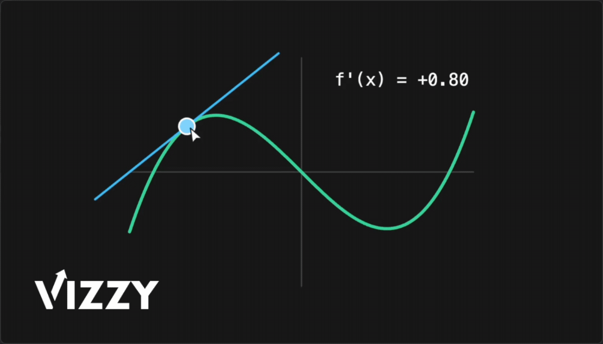

# Vizzy

[](https://www.npmjs.com/package/@vizzyjs/core)
[](https://github.com/blparker/vizzy/actions/workflows/ci.yml)
[](https://bundlephobia.com/package/@vizzyjs/core)
[](https://www.npmjs.com/package/@vizzyjs/core)
[](./LICENSE)

Interactive visualization for TypeScript, built for the browser.

[Documentation](https://vizzyjs.dev) · [Examples](https://vizzyjs.dev/examples/) · [Hub](https://hub.vizzyjs.dev)

> **Status:** pre-1.0 (`0.1.x`). The API is stabilizing but may still change between minor versions.

<p align="center">
  
</p>

## Why Vizzy?

Vizzy is for interactive visuals you can drop into a page. It's for people writing technical content (blog posts, docs, tutorials, explorable essays) who've hit the wall where static charts aren't enough but a whole JavaScript framework feels like overkill just to make a diagram move. Function graphs, geometric diagrams, algorithm walkthroughs: anywhere a moving, touchable picture beats prose.

It runs in TypeScript, renders in the browser, and is interactive by default, so you can drop a draggable derivative into a blog post, visualize a sorting algorithm in your docs, embed a classroom demo in a textbook, or prototype a visual proof directly in the page.

If you've used [manim](https://www.manim.community/), you'll recognize a few ideas. Vizzy is its own project, shaped around the browser, async/await, and live interaction rather than offline video rendering.

## Quick start

```bash
npm install @vizzyjs/core @vizzyjs/renderer-canvas
```

```typescript
import { circle, fadeIn, sky } from '@vizzyjs/core';
import { createScene } from '@vizzyjs/renderer-canvas';

const canvas = document.querySelector('canvas')!;
const { add, play, grid } = createScene(canvas);

grid();
const c = circle({ radius: 1, color: sky });
add(c);
await play(fadeIn(c));
```

[▶ Open in Hub](https://hub.vizzyjs.dev/?code=Z3JpZCgpOwpjb25zdCBjID0gY2lyY2xlKHsgcmFkaXVzOiAxLCBjb2xvcjogc2t5IH0pOwphZGQoYyk7CmF3YWl0IHBsYXkoZmFkZUluKGMpKTs=)

Using React? See [`@vizzyjs/react`](./packages/react) for a `useScene` hook that handles the canvas ref and lifecycle for you.

## Animate it

`play()` returns a Promise. `await` sequences animations without queues or schedulers.

```typescript
import { circle, fadeIn, fadeOut, animateShift, animateRotate, animateColor, sky, violet } from '@vizzyjs/core';
import { createScene } from '@vizzyjs/renderer-canvas';

const canvas = document.querySelector('canvas')!;
const { add, play } = createScene(canvas);

const c = circle({ color: sky });
add(c);

await play(fadeIn(c));
await play(animateShift(c, [3, 0]));
await play(animateRotate(c, Math.PI * 2));
await play(animateColor(c, { stroke: violet }));
await play(fadeOut(c));
```

[▶ Open in Hub](https://hub.vizzyjs.dev/?code=Y29uc3QgYyA9IGNpcmNsZSh7IGNvbG9yOiBza3kgfSk7CmFkZChjKTsKCmF3YWl0IHBsYXkoZmFkZUluKGMpKTsKYXdhaXQgcGxheShhbmltYXRlU2hpZnQoYywgWzMsIDBdKSk7CmF3YWl0IHBsYXkoYW5pbWF0ZVJvdGF0ZShjLCBNYXRoLlBJICogMikpOwphd2FpdCBwbGF5KGFuaW1hdGVDb2xvcihjLCB7IHN0cm9rZTogdmlvbGV0IH0pKTsKYXdhaXQgcGxheShmYWRlT3V0KGMpKTs=)

## Make it interactive

Drag a point around and update its label in world coordinates.

```typescript
import { circle, text, sky, white } from '@vizzyjs/core';
import { createScene } from '@vizzyjs/renderer-canvas';

const canvas = document.querySelector('canvas')!;
const { add, grid, interact } = createScene(canvas);

grid();

const dot = circle({ radius: 0.2, style: { fill: sky, stroke: null } });
const label = text({
    content: '(0.0, 0.0)',
    position: [0, 0.5],
    style: { fill: white, fontSize: 0.25 },
});
add(dot, label);

interact.draggable(dot, {
    onDrag(pos) {
        dot.moveTo(pos);
        label.position = [pos[0], pos[1] + 0.5];
        label.content = '(' + pos[0].toFixed(1) + ', ' + pos[1].toFixed(1) + ')';
    },
});
```

[▶ Open in Hub](https://hub.vizzyjs.dev/?code=Z3JpZCgpOwoKY29uc3QgZG90ID0gY2lyY2xlKHsgcmFkaXVzOiAwLjIsIHN0eWxlOiB7IGZpbGw6IHNreSwgc3Ryb2tlOiBudWxsIH0gfSk7CmNvbnN0IGxhYmVsID0gdGV4dCh7CiAgICBjb250ZW50OiAnKDAuMCwgMC4wKScsCiAgICBwb3NpdGlvbjogWzAsIDAuNV0sCiAgICBzdHlsZTogeyBmaWxsOiB3aGl0ZSwgZm9udFNpemU6IDAuMjUgfSwKfSk7CmFkZChkb3QsIGxhYmVsKTsKCmludGVyYWN0LmRyYWdnYWJsZShkb3QsIHsKICAgIG9uRHJhZyhwb3MpIHsKICAgICAgICBkb3QubW92ZVRvKHBvcyk7CiAgICAgICAgbGFiZWwucG9zaXRpb24gPSBbcG9zWzBdLCBwb3NbMV0gKyAwLjVdOwogICAgICAgIGxhYmVsLmNvbnRlbnQgPSAnKCcgKyBwb3NbMF0udG9GaXhlZCgxKSArICcsICcgKyBwb3NbMV0udG9GaXhlZCgxKSArICcpJzsKICAgIH0sCn0pOw==)

## Packages

| Package                                                  | Description                                                           |
| -------------------------------------------------------- | --------------------------------------------------------------------- |
| [`@vizzyjs/core`](./packages/core)                       | Render-agnostic core: shapes, scene graph, animations, math utilities |
| [`@vizzyjs/renderer-canvas`](./packages/renderer-canvas) | Canvas2D renderer with controls and interaction                       |
| [`@vizzyjs/react`](./packages/react)                     | React bindings: `useScene` hook                                       |

## Highlights

-   **Shapes, not draw calls.** 30+ factories (circles, axes, function graphs, TeX, arrows, braces, angles) with defaults that don't make you fight them.
-   **Animate with `await`.** `await play(fadeIn(c))` does the obvious thing. Sequence with `await`, parallelize with `play(a, b, c)`. No animation scheduler to learn.
-   **Interaction isn't an afterthought.** Shapes can be dragged, hovered, and clicked. Sliders, checkboxes, and color pickers re-render the scene on change. No event wiring required.
-   **Think in math, not pixels.** 14×8 world units, Y-up, origin at center. `radius: 1` is a unit circle, not a 100-pixel blob. DPR and canvas resize handled for you.
-   **Made for calculus.** Function graphs handle discontinuities without drawing phantom vertical lines. One-call helpers for tangents, secants, KaTeX labels, braces, and annotations.
-   **Colors you won't have to google.** The full Tailwind palette (22 scales × 11 shades) baked in. Reach for `sky[400]` instead of memorizing `#0ea5e9`.

## Development

This is a pnpm workspace.

```bash
pnpm install
pnpm playground   # local dev sandbox with Monaco editor + live preview
pnpm test
pnpm typecheck
```

See [`CONTRIBUTING.md`](./CONTRIBUTING.md) for how to actually ship a contribution: workflow, code conventions, and tips on adding new shapes or animations.

## License

[MIT](./LICENSE)
