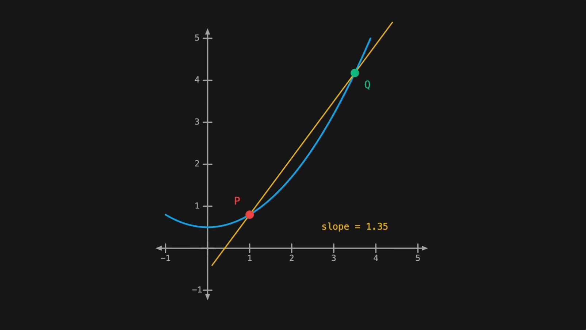

# vizzy

[](https://www.npmjs.com/package/@vizzyjs/core)
[](https://github.com/blparker/vizzy/actions/workflows/ci.yml)
[](https://bundlephobia.com/package/@vizzyjs/core)
[](https://www.npmjs.com/package/@vizzyjs/core)
[](./LICENSE)

Interactive math visualization for TypeScript, built for the browser.

[Documentation](https://vizzyjs.dev) · [Examples](https://vizzyjs.dev/examples/) · [Hub](https://hub.vizzyjs.dev)

> **Status:** pre-1.0 (`0.1.x`). The API is stabilizing but may still change between minor versions.

<p align="center">
  
</p>

## Why vizzy?

Vizzy is aimed at the math-teaching idiom: function graphs, tangent lines, annotated diagrams, limits, animated transformations. It runs in TypeScript, draws to Canvas2D, and is interactive by default, so you can drop a draggable derivative into a blog post, embed a classroom demo in a textbook, or prototype a visual proof directly in the browser.

If you've used [manim](https://www.manim.community/), you'll recognize a few ideas. Vizzy is its own project, shaped around the browser, async/await, and live interaction rather than offline video rendering.

## Quick start

```bash
npm install @vizzyjs/core @vizzyjs/renderer-canvas
```

```typescript
import { circle, fadeIn, sky } from '@vizzyjs/core';
import { createScene } from '@vizzyjs/renderer-canvas';

const canvas = document.querySelector('canvas')!;
const { add, play, grid } = createScene(canvas);

grid();
const c = circle({ radius: 1, color: sky });
add(c);
await play(fadeIn(c));
```

[▶ Open in Hub](https://hub.vizzyjs.dev/?code=Z3JpZCgpOwpjb25zdCBjID0gY2lyY2xlKHsgcmFkaXVzOiAxLCBjb2xvcjogc2t5IH0pOwphZGQoYyk7CmF3YWl0IHBsYXkoZmFkZUluKGMpKTs=)

Using React? See [`@vizzyjs/react`](./packages/react) for a `useScene` hook that handles the canvas ref and lifecycle for you.

## Animate it

`play()` returns a Promise. `await` sequences animations without queues or schedulers.

```typescript
import { circle, fadeIn, fadeOut, animateShift, animateRotate, animateColor, sky, violet } from '@vizzyjs/core';
import { createScene } from '@vizzyjs/renderer-canvas';

const canvas = document.querySelector('canvas')!;
const { add, play } = createScene(canvas);

const c = circle({ color: sky });
add(c);

await play(fadeIn(c));
await play(animateShift(c, [3, 0]));
await play(animateRotate(c, Math.PI * 2));
await play(animateColor(c, { stroke: violet }));
await play(fadeOut(c));
```

[▶ Open in Hub](https://hub.vizzyjs.dev/?code=aW1wb3J0JTIwJTdCJTIwY2lyY2xlJTJDJTIwZmFkZUluJTJDJTIwZmFkZU91dCUyQyUyMGFuaW1hdGVTaGlmdCUyQyUyMGFuaW1hdGVSb3RhdGUlMkMlMjBhbmltYXRlQ29sb3IlMkMlMjBza3klMkMlMjB2aW9sZXQlMjAlN0QlMjBmcm9tJTIwJyU0MHZpenp5anMlMkZjb3JlJyUzQiUwQWltcG9ydCUyMCU3QiUyMGNyZWF0ZVNjZW5lJTIwJTdEJTIwZnJvbSUyMCclNDB2aXp6eWpzJTJGcmVuZGVyZXItY2FudmFzJyUzQiUwQSUwQWNvbnN0JTIwY2FudmFzJTIwJTNEJTIwZG9jdW1lbnQucXVlcnlTZWxlY3RvcignY2FudmFzJyklM0IlMEFjb25zdCUyMCU3QiUyMGFkZCUyQyUyMHBsYXklMjAlN0QlMjAlM0QlMjBjcmVhdGVTY2VuZShjYW52YXMpJTNCJTBBJTBBY29uc3QlMjBjJTIwJTNEJTIwY2lyY2xlKCU3QiUyMGNvbG9yJTNBJTIwc2t5JTIwJTdEKSUzQiUwQWFkZChjKSUzQiUwQSUwQWF3YWl0JTIwcGxheShmYWRlSW4oYykpJTNCJTBBYXdhaXQlMjBwbGF5KGFuaW1hdGVTaGlmdChjJTJDJTIwJTVCMyUyQyUyMDAlNUQpKSUzQiUwQWF3YWl0JTIwcGxheShhbmltYXRlUm90YXRlKGMlMkMlMjBNYXRoLlBJJTIwKiUyMDIpKSUzQiUwQWF3YWl0JTIwcGxheShhbmltYXRlQ29sb3IoYyUyQyUyMCU3QiUyMHN0cm9rZSUzQSUyMHZpb2xldCUyMCU3RCkpJTNCJTBBYXdhaXQlMjBwbGF5KGZhZGVPdXQoYykpJTNCJTBB)

## Make it interactive

Drag a point around and update its label in world coordinates.

```typescript
import { circle, text, sky, white } from '@vizzyjs/core';
import { createScene } from '@vizzyjs/renderer-canvas';

const canvas = document.querySelector('canvas')!;
const { add, grid, interact } = createScene(canvas);

grid();

const dot = circle({ radius: 0.2, style: { fill: sky, stroke: null } });
const label = text({
    content: '(0.0, 0.0)',
    position: [0, 0.5],
    style: { fill: white, fontSize: 0.25 },
});
add(dot, label);

interact.draggable(dot, {
    onDrag(pos) {
        dot.moveTo(pos);
        label.position = [pos[0], pos[1] + 0.5];
        label.content = '(' + pos[0].toFixed(1) + ', ' + pos[1].toFixed(1) + ')';
    },
});
```

[▶ Open in Hub](https://hub.vizzyjs.dev/?code=aW1wb3J0JTIwJTdCJTIwY2lyY2xlJTJDJTIwdGV4dCUyQyUyMHNreSUyQyUyMHdoaXRlJTIwJTdEJTIwZnJvbSUyMCclNDB2aXp6eWpzJTJGY29yZSclM0IlMEFpbXBvcnQlMjAlN0IlMjBjcmVhdGVTY2VuZSUyMCU3RCUyMGZyb20lMjAnJTQwdml6enlqcyUyRnJlbmRlcmVyLWNhbnZhcyclM0IlMEElMEFjb25zdCUyMGNhbnZhcyUyMCUzRCUyMGRvY3VtZW50LnF1ZXJ5U2VsZWN0b3IoJ2NhbnZhcycpJTNCJTBBY29uc3QlMjAlN0IlMjBhZGQlMkMlMjBncmlkJTJDJTIwaW50ZXJhY3QlMjAlN0QlMjAlM0QlMjBjcmVhdGVTY2VuZShjYW52YXMpJTNCJTBBJTBBZ3JpZCgpJTNCJTBBJTBBY29uc3QlMjBkb3QlMjAlM0QlMjBjaXJjbGUoJTdCJTIwcmFkaXVzJTNBJTIwMC4yJTJDJTIwc3R5bGUlM0ElMjAlN0IlMjBmaWxsJTNBJTIwc2t5JTJDJTIwc3Ryb2tlJTNBJTIwbnVsbCUyMCU3RCUyMCU3RCklM0IlMEFjb25zdCUyMGxhYmVsJTIwJTNEJTIwdGV4dCglN0IlMEElMjAlMjAlMjAlMjBjb250ZW50JTNBJTIwJygwLjAlMkMlMjAwLjApJyUyQyUwQSUyMCUyMCUyMCUyMHBvc2l0aW9uJTNBJTIwJTVCMCUyQyUyMDAuNSU1RCUyQyUwQSUyMCUyMCUyMCUyMHN0eWxlJTNBJTIwJTdCJTIwZmlsbCUzQSUyMHdoaXRlJTJDJTIwZm9udFNpemUlM0ElMjAwLjI1JTIwJTdEJTJDJTBBJTdEKSUzQiUwQWFkZChkb3QlMkMlMjBsYWJlbCklM0IlMEElMEFpbnRlcmFjdC5kcmFnZ2FibGUoZG90JTJDJTIwJTdCJTBBJTIwJTIwJTIwJTIwb25EcmFnKHBvcyklMjAlN0IlMEElMjAlMjAlMjAlMjAlMjAlMjAlMjAlMjBkb3QubW92ZVRvKHBvcyklM0IlMEElMjAlMjAlMjAlMjAlMjAlMjAlMjAlMjBsYWJlbC5wb3NpdGlvbiUyMCUzRCUyMCU1QnBvcyU1QjAlNUQlMkMlMjBwb3MlNUIxJTVEJTIwJTJCJTIwMC41JTVEJTNCJTBBJTIwJTIwJTIwJTIwJTIwJTIwJTIwJTIwbGFiZWwuY29udGVudCUyMCUzRCUyMCcoJyUyMCUyQiUyMHBvcyU1QjAlNUQudG9GaXhlZCgxKSUyMCUyQiUyMCclMkMlMjAnJTIwJTJCJTIwcG9zJTVCMSU1RC50b0ZpeGVkKDEpJTIwJTJCJTIwJyknJTNCJTBBJTIwJTIwJTIwJTIwJTdEJTJDJTBBJTdEKSUzQiUwQQ%3D%3D)

## Packages

| Package                                                  | Description                                                           |
| -------------------------------------------------------- | --------------------------------------------------------------------- |
| [`@vizzyjs/core`](./packages/core)                       | Render-agnostic core: shapes, scene graph, animations, math utilities |
| [`@vizzyjs/renderer-canvas`](./packages/renderer-canvas) | Canvas2D renderer with controls and interaction                       |
| [`@vizzyjs/react`](./packages/react)                     | React bindings: `useScene` hook                                       |

## Highlights

-   **30+ shape factories:** `circle()`, `rect()`, `line()`, `arrow()`, `axes()`, `functionGraph()`, `tex()`, `brace()`, `angleShape()`, and more
-   **Async/await animations:** `await play(fadeIn(c))`. No queues, no schedulers, just native promises.
-   **Interactive out of the box:** draggable shapes, hover/click handlers, HTML controls (sliders, checkboxes, color pickers) that auto-render on change
-   **World coordinates, not pixels:** 14×8 world units with Y-up, origin at center. DPR scaling is automatic.
-   **Calculus-ready:** discontinuity handling, tangent/secant helpers, annotations, TeX rendering via KaTeX
-   **Full Tailwind palette:** `sky`, `emerald`, `violet`, 22 scales × 11 shades

## Development

This is a pnpm workspace.

```bash
pnpm install
pnpm playground   # local dev sandbox with Monaco editor + live preview
pnpm test
pnpm typecheck
```

## License

[MIT](./LICENSE)
